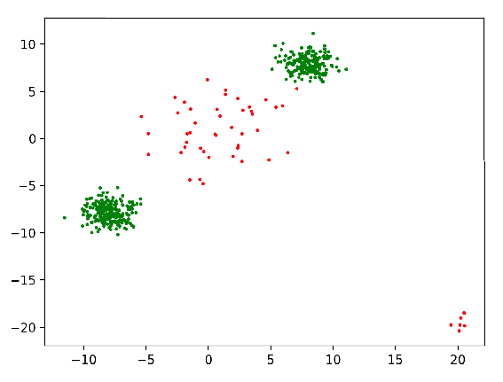
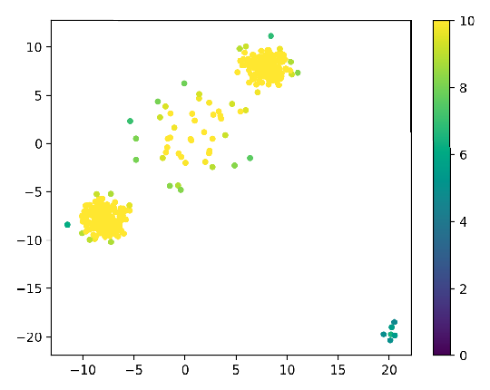

# An Example

Here we walk through the basic usage of the `crcf` package with an example. 
To understand in more detail how the forests work mathematically see the
[overview](overview.pdf). 

## Creating Fake Data
Before we can find anomalies in data, we need data! You can ignore most of this
if yo8u just want to see the package in use. 

```python
def gaussian_mixture(ps, means, covs, count=100):
    counts = np.random.multinomial(count, ps, size=1)[0] # how many points are from each component
    
    data = [np.random.multivariate_normal(means[i], covs[i], count) for i, count in enumerate(counts)]
    data = np.concatenate(data) # combine the data
    
    # shuffle the data
    new_index = np.arange(data.shape[0])
    np.random.shuffle(np.arange(data.shape[0]))
    data = data[new_index]
    return data

def generate_test(N, anomalous_rate):
    # Calculate how many data points there will be in each category
    typical_count, anomalous_count = np.random.multinomial(N, [1-anomalous_rate, anomalous_rate], size=1)[0]

    # Describe typical data with a 2 component Gaussian mixture
    typical_means = [[8, 8],      # mean of component 1
                    [-8, -8]]     # mean of component 2
    typical_covs = [[[1,0],[0,1]],  # covariance matrix of component 1
                    [[1,0],[0,1]]]  # covariance matrix of compoinent 2
    typical_ps = [0.5,              # probability of component 1
                  0.5]              # probability of component 2
    typical_data = gaussian_mixture(typical_ps, typical_means, typical_covs, count=typical_count)

    # Describe anomalous data with a 2 component Gaussian mixture
    anomalous_means = [[20, -20],            # mean of component 1
                      [0, 0]]                # mean of component 2
    anomalous_covs = [[[0.5, 0], [0, 0.5]],  # covariance of component 1
                      [[10, 0], [0, 10]]]    # covariance of component 2
    anomalous_ps = [0.1,                      # probability of component 1
                  0.9]                       # probability of component 2
    anomalous_data = gaussian_mixture(anomalous_ps, anomalous_means, anomalous_covs, count=anomalous_count)

    # Combine the data but preserve the labeling
    x = np.concatenate([typical_data, anomalous_data])
    y = np.concatenate([np.repeat(0, typical_count), np.repeat(1, anomalous_count)])
    new_index = np.arange(y.shape[0])
    np.random.shuffle(new_index)
    y = y[new_index]
    x = x[new_index]
    return x, y

def plot_anom(x, y):
    """ plots anomalies with red and typical with green"""
    fig, ax = plt.subplots()
    ax.scatter(x[:,0], x[:,1], s=3, 
               c=['red' if yy else 'green' for yy in y])
    fig.show()
```

Now, generate data using the above functions. 

```python
N = 500  # number of data points to generate
anomalous_rate = 0.1  # the rate at which anomalous points occur
x, y = generate_test(N, anomalous_rate)
plot_anom(x, y)
```

Below, we can see some example data with points colored green for nominal data and red for anomalous data. 



## Fitting a forest
```python
from crcf import CombinationForest
forest = CombinationForest()
forest.fit(x)
```
Now, we have a fitted forest. 

## Using a fitted forest
You can get the depth of a point with 
```python
point = np.array([5, 5, 5])
forest.depth(point)
```

Alternatively, you can score points. 
```python
scores = [forest.score(np.array([xx])) for xx in x]
```

We can then look at the scores as a scatterplot:
```python
fig, ax = plt.subplots()
im = ax.scatter(x[:,0], x[:,1], s=15, c=scores, vmin=0, vmax=10)
fig.colorbar(im)
fig.show()
```




